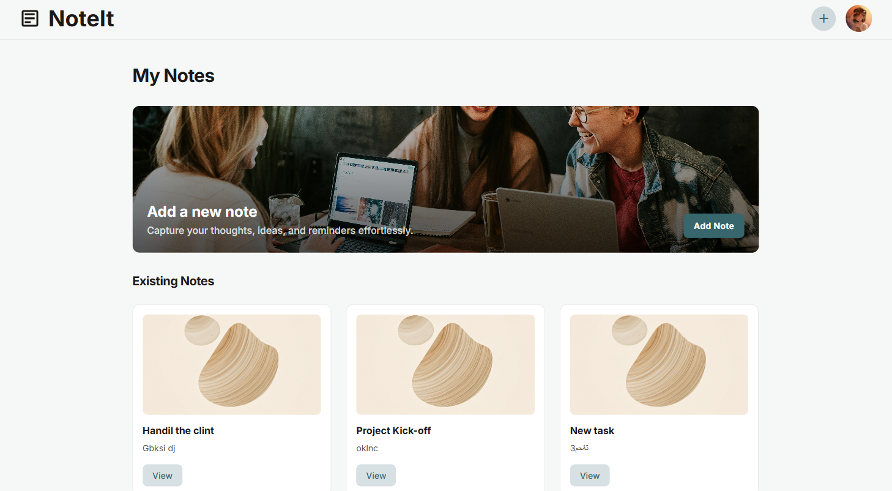
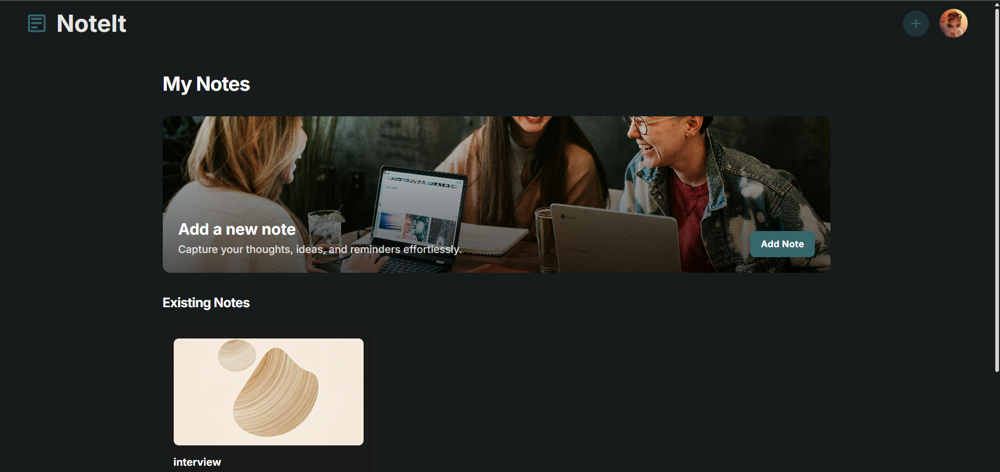
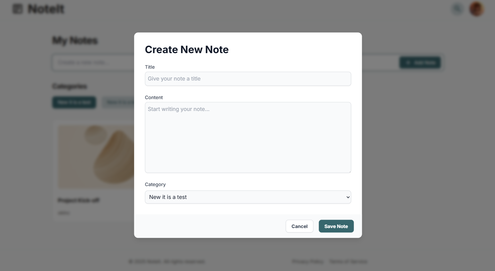
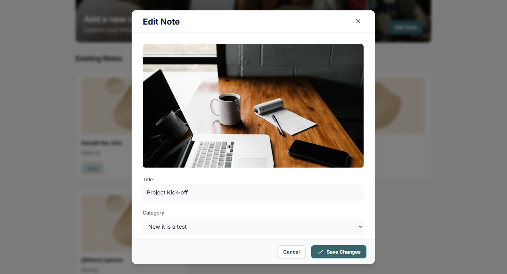
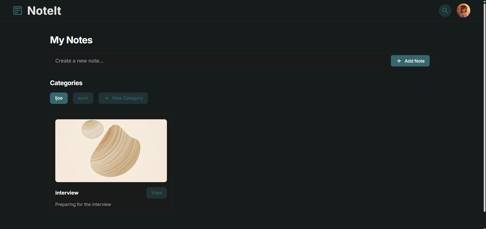
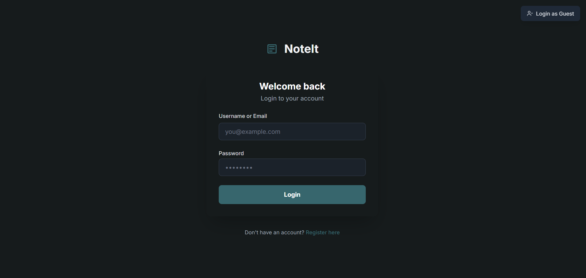
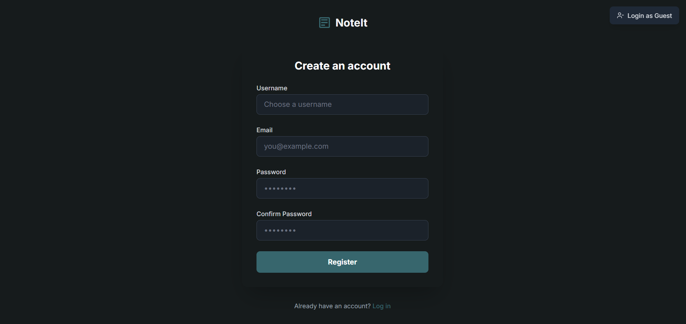

# 🗒️ NoteIt – Personal Notes Management App

[](https://your-app.vercel.app)
[](https://github.com/aliopas/NoteIt)
[](LICENSE)

> A modern, full-stack notes management application with secure authentication, category organization, and a clean, responsive interface.

---

## 📸 Preview

### 🌓 Dashboard Views

<table>
  <tr>
    <td width="50%">
      <h4>Light Mode</h4>
      
    </td>
    <td width="50%">
      <h4>Dark Mode</h4>
      
    </td>
  </tr>
</table>

### 📝 Create & Edit Notes

<table>
  <tr>
    <td width="50%">
      <h4>Create Note</h4>
      
    </td>
    <td width="50%">
      <h4>Edit Note</h4>
      
    </td>
  </tr>
  <tr>
    <td colspan="2">
      <h4>Dark Mode - Create</h4>
      
    </td>
  </tr>
</table>

### 🔐 Authentication

<table>
  <tr>
    <td width="50%">
      <h4>Login</h4>
      
    </td>
    <td width="50%">
      <h4>Register</h4>
      
    </td>
  </tr>
</table>

---

🔗 **[Try it Live](https://your-app.vercel.app)** | 💻 **[View Source Code](https://github.com/aliopas/NoteIt)**

---

## 🚀 Overview

**NoteIt** is a full-stack notes management web application that helps users organize their thoughts, ideas, and reminders efficiently. Built with modern web technologies, it offers a seamless experience with secure authentication, category-based organization, and real-time updates.

### ✨ Key Highlights

- 🔐 **Secure Authentication** with JWT & HttpOnly cookies
- 📁 **Category Management** for organized note-keeping
- 🔍 **Smart Search** across notes and categories
- 🌓 **Dark/Light Mode** for comfortable viewing
- 📱 **Fully Responsive** design for all devices
- ⚡ **Real-time Updates** with React Query
- 🎨 **Modern UI** with Tailwind CSS

---

## 🧩 Tech Stack

<table>
  <tr>
    <td><b>Frontend</b></td>
    <td>React 19, React Router, React Query, Tailwind CSS</td>
  </tr>
  <tr>
    <td><b>Backend</b></td>
    <td>Node.js, Express.js</td>
  </tr>
  <tr>
    <td><b>Database</b></td>
    <td>CockroachDB (PostgreSQL-compatible)</td>
  </tr>
  <tr>
    <td><b>Authentication</b></td>
    <td>JWT (JSON Web Tokens)</td>
  </tr>
  <tr>
    <td><b>State Management</b></td>
    <td>React Query (TanStack Query)</td>
  </tr>
  <tr>
    <td><b>Deployment</b></td>
    <td>Vercel (Frontend) + Railway (Backend)</td>
  </tr>
</table>

---

## 🎯 Features

### ✅ Current Features (v1.0)

- **User Authentication**
  - Secure registration and login system
  - JWT-based authentication with HttpOnly cookies
  - Protected routes with automatic redirects
  - Logout functionality

- **Notes Management**
  - Create, read, update, and delete notes
  - Rich text content support
  - Timestamps for creation and updates
  - Category-based organization

- **Categories System**
  - Create custom categories
  - Organize notes by category
  - Category filtering

- **Search & Filter**
  - Search popup for quick access
  - Filter by notes and categories
  - Real-time search results

- **User Experience**
  - Toast notifications for actions
  - Loading states and error handling
  - Form validation
  - Dark/Light mode toggle
  - Responsive design

---

### 🚧 Planned Features (v2.0+)

- [ ] Edit and delete categories
- [ ] User profile page with avatar upload
- [ ] Advanced search filters (by date, content, tags)
- [ ] Pin and archive notes
- [ ] Rich text editor with markdown support
- [ ] Note sharing capabilities
- [ ] Export notes (PDF, Markdown)
- [ ] Tags system
- [ ] Note templates
- [ ] Trash/Recovery system
- [ ] AI-powered note organization (future vision)

---

## ⚙️ Installation & Setup

### Prerequisites

- Node.js (v18 or higher)
- npm or yarn
- CockroachDB account (or PostgreSQL)

### 1️⃣ Clone the Repository

```bash
git clone https://github.com/aliopas/NoteIt.git
cd NoteIt
```

### 2️⃣ Install Dependencies

**Backend:**
```bash
cd back-end
npm install
```

**Frontend:**
```bash
cd my-project
npm install
```

### 3️⃣ Environment Variables

**Backend (.env):**
```env
PORT=3000
DATABASE_URL=your_cockroachdb_connection_string
JWT_SECRET=your_super_secret_key_here
NODE_ENV=development
FRONTEND_URL=http://localhost:5173
```

**Frontend (.env.local):**
```env
VITE_API_URL=http://localhost:3000
```

### 4️⃣ Database Setup

Run the SQL schema to create tables:

```bash
# Connect to your CockroachDB and run:
# schema.sql file contents
```

### 5️⃣ Run the Application

**Backend:**
```bash
cd back-end
npm run dev
```

**Frontend:**
```bash
cd my-project
npm run dev
```

**Access the app:**
- Frontend: `http://localhost:5173`
- Backend API: `http://localhost:3000`

---

## 📡 API Endpoints

### Authentication
| Method | Endpoint | Description |
|--------|----------|-------------|
| POST | `/api/auth/register` | Register new user |
| POST | `/api/auth/login` | Login user |
| POST | `/api/auth/logout` | Logout user |
| GET | `/api/auth/me` | Get current user |

### Notes
| Method | Endpoint | Description |
|--------|----------|-------------|
| GET | `/api/data/all` | Get all user data |
| POST | `/api/notes` | Create new note |
| PUT | `/api/notes/:id` | Update note |
| DELETE | `/api/notes/:id` | Delete note |

### Categories
| Method | Endpoint | Description |
|--------|----------|-------------|
| POST | `/api/categories` | Create category |

---

## 📁 Project Structure

```
NoteIt/
├── back-end/              # Express Backend
│   ├── routes/            # API route definitions
│   │   └── auth.js        # Authentication routes
│   ├── middleware/        # Custom middleware
│   │   └── authMiddleware.js
│   ├── db.js              # Database configuration
│   ├── server.js          # Main server file
│   └── package.json
│
├── my-project/            # React Frontend
│   ├── src/
│   │   ├── components/    # Reusable UI components
│   │   ├── hooks/         # Custom hooks
│   │   │   ├── useAuth.jsx
│   │   │   ├── useUserData.jsx
│   │   │   └── ProtectedRoute.jsx
│   │   ├── pag/           # Main pages
│   │   │   ├── Dashboard.jsx
│   │   │   ├── Login.jsx
│   │   │   ├── Register.jsx
│   │   │   └── Create.jsx
│   │   ├── utils/         # Utility functions
│   │   │   └── api.js
│   │   ├── App.jsx        # Main app component
│   │   └── main.jsx       # Entry point
│   ├── public/
│   ├── vercel.json        # Vercel configuration
│   ├── vite.config.js     # Vite configuration
│   └── package.json
│
└── README.md
```

---

## 🚀 Deployment

### Frontend (Vercel)

1. Push your code to GitHub
2. Import project on [Vercel](https://vercel.com)
3. Set Root Directory to `my-project`
4. Add environment variable: `VITE_API_URL`
5. Deploy!

### Backend (Railway)

1. Create new project on [Railway](https://railway.app)
2. Connect your GitHub repository
3. Set Root Directory to `back-end`
4. Add environment variables
5. Deploy!

### Database (CockroachDB Cloud)

1. Create cluster on [CockroachDB](https://cockroachlabs.cloud)
2. Copy connection string
3. Update `DATABASE_URL` in backend environment

---

## 🧪 Testing

```bash
# Run backend tests
cd back-end
npm test

# Run frontend tests
cd my-project
npm test
```

---

## 🤝 Contributing

Contributions are welcome! Please feel free to submit a Pull Request.

### How to Contribute

1. Fork the project
2. Create your feature branch (`git checkout -b feature/AmazingFeature`)
3. Commit your changes (`git commit -m 'Add some AmazingFeature'`)
4. Push to the branch (`git push origin feature/AmazingFeature`)
5. Open a Pull Request

---

## 📝 Development Timeline

- **October 2024**: Initial concept and planning
- **November 2024**: Core features development
- **Week 1**: Authentication system
- **Week 2**: Notes CRUD operations
- **Week 3**: Categories and search
- **Week 4**: UI/UX improvements and deployment
- **v1.0 Release**: November 15, 2024

---

## 🐛 Known Issues

- Category editing not yet implemented
- Search could be more performant with large datasets
- Mobile UI needs some refinements

---

## 📄 License

This project is licensed under the MIT License - see the [LICENSE](LICENSE) file for details.

---

## 👨‍💻 About the Developer

**Ali Alaa** - Full-Stack Developer

I'm passionate about building modern, scalable web applications with clean code and great user experiences. NoteIt is my second major project, demonstrating my skills in full-stack development with React and Node.js.

### 🔗 Connect with Me

- 💼 [LinkedIn](https://linkedin.com/in/yourprofile)
- 🐙 [GitHub](https://github.com/aliopas)
- 📧 [Email](mailto:your.email@example.com)
- 🌐 Portfolio: Coming Soon

### 💡 Skills

`React` `Node.js` `Express` `PostgreSQL` `CockroachDB` `JWT` `React Query` `Tailwind CSS` `Git` `REST APIs` `Full-Stack Development`

---

## ⭐ Show your support

If you like this project, please consider giving it a ⭐ on GitHub!

---

## 📮 Feedback

Have suggestions or found a bug? Feel free to [open an issue](https://github.com/aliopas/NoteIt/issues) or reach out!

---

<p align="center">Made with ❤️ by Ali Alaa</p>
<p align="center">© 2024 NoteIt. All rights reserved.</p>
